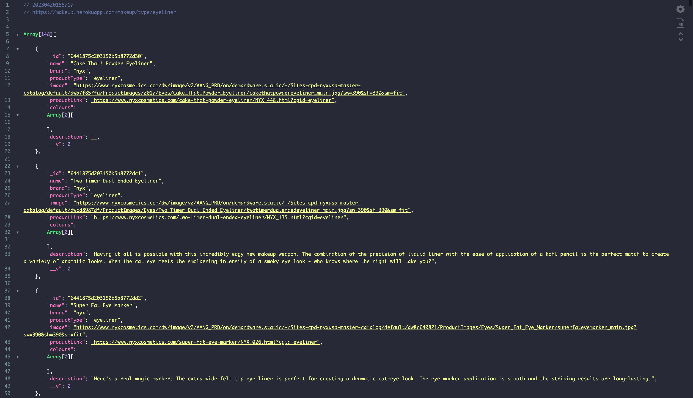
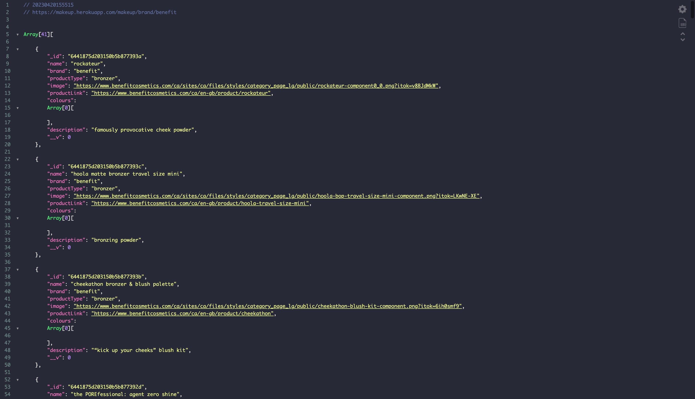
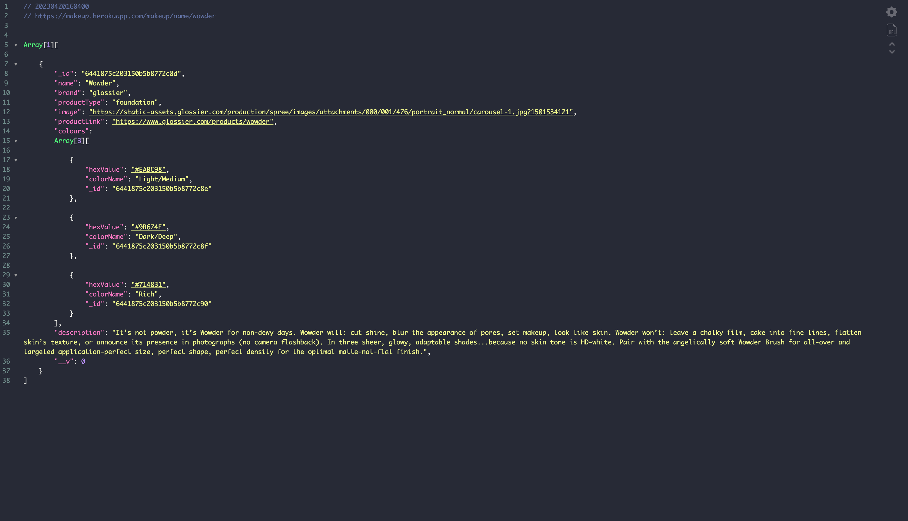

 

# __MAKEUP API__
  


##  •───────•°•❀•°•───────•
  
<br>

##  ***Calls & Paths***: 
### Endpoints: <br> 

GET:
- <a href="https://makeup.herokuapp.com">root</a>: makeup.herokuapp.com
- <a href="https://makeup.herokuapp.com/makeup" >full database</a>: makeup.herokuapp.com/makeup 
- get by product type: /type/:productType
  - <a href="https://makeup.herokuapp.com/makeup/type/mascara" >mascara</a>: /type/mascara
- get by brand: /brand/:brand
  - <a href="https://makeup.herokuapp.com/makeup/brand/colourpop" >colourpop</a>: /brand/colourpop
- get by makeup name: name/:name 
  - <a href="https://makeup.herokuapp.com/makeup/name/cloud paint" >cloud paint</a>: /name/cloud paint


POST: <br>
  add new makeup: /

PUT: <br>
  update makeup by ID: /:id

DELETE: <br>
  delete a makeup entry by ID: /:id

<br>

### Filters

- search for eyeliner: /type/eyeliner <br>
*example*:
[makeup.herokuapp.com/type/eyeliner](https://makeup.herokuapp.com/type/eyeliner)


- search for the brand "benefit": /brands/benefit <br>
*example*:
[makeup.herokuapp.com/brands/benefit](https://makeup.herokuapp.com/brands/benefit)


- search for the name "wowder": /name/wowder <br>
*example*:
[makeup.herokuapp.com/name/wowder](https://makeup.herokuapp.com/name/wowder)


---

<br>

### ***brands in database:***
<br>


```
almay
alva
anna sui
annabelle
benefit
boosh
burt's bees
butter london
c'est moi
cargo cosmetics
china glaze
clinique
coastal classic creation
colourpop
covergirl
dalish
deciem
dior
dr. hauschka
e.l.f.
essie
fenty
glossier
green people
iman
l'oreal
lotus cosmetics usa
maia's mineral galaxy
marcelle
marienatie
maybelline
milani
mineral fusion
misa
mistura
moov
nudus
nyx
orly
pacifica
penny lane organics
physicians formula
piggy paint
pure anada
rejuva minerals
revlon
sally b's skin yummies
salon perfect
sante
sinful colours
smashbox
stila
suncoat
w3llpeople
wet n wild
zorah
zorah biocosmetiques
```
---


### ***Dependencies***


- express
- mongoose
- cors
- chalk
- nodemon


----
----
----
Source: <a href="https://www.makeup-api.herokuapp.com/" >Makeup API</a>


